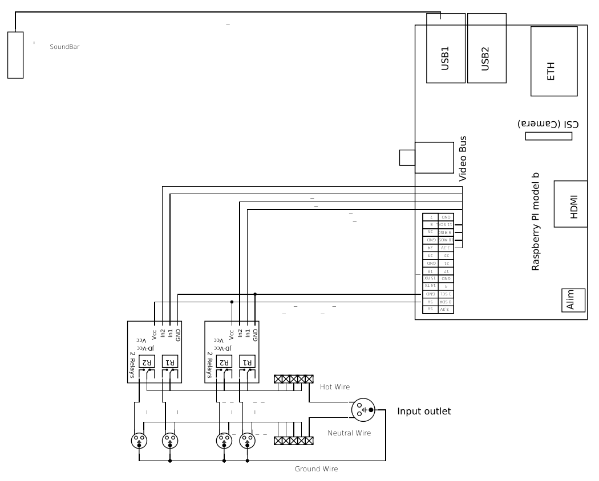

# Media center controller with a numpad keyboard

## Project goals

To have a device managing bunch of connected electronics (soundbar, turntable, preamp, printer, etc)
from a physical mini keyboard:
1. Turn on/off printer
2. Turn on/off soundbar + turntable
3. Turn on/off soundbar + select mode for movie watching or music streaming

## Hardware

1. Raspberry Pi 2B
2. Relays controller with 4 relays
3. YSP-4000 soundbar (see [ysp-4000 repo](https://github.com/pzbitskiy/yamaha-ysp-4000))
4. Dell 1700 printer (CUPS + Lexmark E234 PPD)
5. Turntable and preamp

### Keyboard setup

Inspired by this [blog post](https://softsolder.com/2016/03/02/raspberry-pi-usb-keypad-via-evdev/)

```sh
cat /proc/bus/input/devices
```

Take vendor id and product id and created udev rule

```sh
sudo bash -c 'cat > /etc/udev/rules.d/KeyPad.rules << EOF
ATTRS{idVendor}=="04b4", ATTRS{idProduct}=="06b0", SYMLINK+="input/keypad"
EOF'

sudo udevadm control --reload
```

Now the keyboard can be opened as `/dev/input/keypad` device:

```python
keypad = InputDevice('/dev/input/keypad')
```

### Relays and RPi

See the wiring diagram


## Installation instructions

### Build

```sh
python3 -m build
```

### Install

On the device

```sh
pip3 install --upgrade --user git+https://github.com/pzbitskiy/media_center_kb

# test
mediackb -v
```

Create systemd service

```sh
sudo bash -c 'cat > /etc/systemd/system/media-center-kb.service <<EOF
[Unit]
Description=Media center keyboard daemon

[Install]
WantedBy=multi-user.target

[Service]
User=pi
ExecStart=mediackb
Type=idle
RemainAfterExit=no
Restart=on-failure
EOF'

sudo systemctl daemon-reload
sudo systemctl start media-center-kb
sudo systemctl enable media-center-kb
```

Ensure it is running

```sh
sudo systemctl --type=service --state=running
```

## Development

### Setup
```sh
python3 -m venv .venv
source .venv/bin/activate
pip3 install -e -r requirements.txt
# or pip install -e .
```

### Test

```sh
pytest
```
